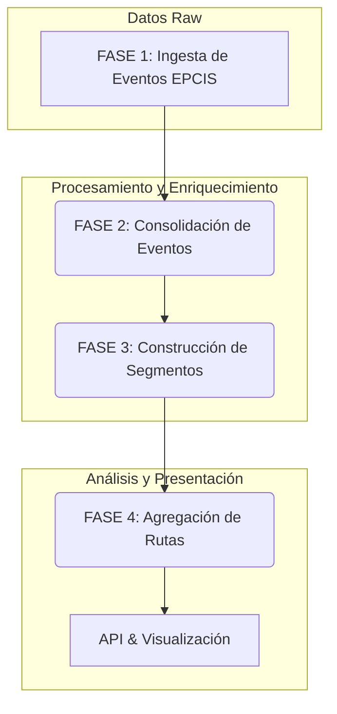

# Documento Técnico: Pipeline de Procesamiento de Datos EPCIS

**Versión:** 1.0
**Fecha:** 2026-02-13

## 1. Introducción

Este documento describe la arquitectura y el flujo de datos del pipeline de procesamiento de eventos EPCIS (Electronic Product Code Information Services). El objetivo de este sistema es ingerir eventos de lectura RFID en tiempo real, enriquecerlos con datos de negocio, construir los journeys de los paquetes, y agregar la información para permitir un análisis de rendimiento y diagnóstico de rutas a gran escala.

El pipeline está diseñado para ser **escalable, incremental y eficiente**, procesando millones de eventos de múltiples carriers, productos y rutas de forma continua.

## 2. Arquitectura General del Pipeline

El proceso se divide en cuatro fases principales que se ejecutan de forma secuencial. Cada fase transforma los datos y los prepara para la siguiente, culminando en una tabla agregada optimizada para la consulta y visualización.



| Fase | Propósito | Frecuencia de Ejecución (Sugerida) |
| :--- | :--- | :--- |
| **1. Ingesta** | Capturar eventos EPCIS en crudo. | Tiempo Real |
| **2. Consolidación** | Enriquecer cada evento con datos de negocio. | Batch (Cada 5-15 minutos) |
| **3. Construcción de Segmentos** | Construir los segmentos de viaje (origen-destino) para cada paquete. | Batch (Cada hora) |
| **4. Agregación de Rutas** | Agrupar los viajes por rutas únicas para análisis de rendimiento. | Batch (Diario) |

---

## 3. FASE 1: Ingesta de Eventos EPCIS

### 3.1. Propósito

Capturar y almacenar los eventos de lectura RFID tal como llegan de los sistemas externos, sin ninguna modificación. Esta fase asegura que no se pierda ningún dato y proporciona una fuente de verdad auditable.

### 3.2. Origen de los Datos

Los eventos EPCIS provienen de una **base de datos externa** gestionada por el sistema de lectores RFID. Nuestra solución expondrá una **API REST** que permitirá al sistema externo enviar los eventos en tiempo real o por lotes.

**Endpoint de Ingesta (a definir):**
```
POST /api/epcis/events
```

Este endpoint recibirá un array de eventos EPCIS y los insertará en `rfid_events_raw`.

### 3.3. Input: Evento EPCIS Raw

El sistema recibe un objeto JSON por cada lectura RFID.

**Ejemplo de Input:**
```json
{
  "EventId": "1a66a44f-c905-4ac4-a8b0-3d1811ef86f0",
  "ReaderId": "J11DBRA02100000319",
  "TagId": "30B1D226A8240000B000650C",
  "ReadLocalDateTime": "2024-05-07T09:53:06.238-03:30"
}
```

### 3.4. Lógica de Procesamiento

La lógica en esta fase es mínima. El sistema simplemente parsea el JSON y lo inserta en la tabla `rfid_events_raw`.

- **`ReaderId`**: Se almacena como el **LPI** (Logical Product Identifier), un identificador de texto único para el lector físico.
- **`TagId`**: Se almacena como el EPC (Electronic Product Code) del paquete.
- **`ReadLocalDateTime`**: Se convierte y almacena como un `TIMESTAMPTZ`.

### 3.5. Output: Tabla `rfid_events_raw`

| Columna | Tipo | Descripción |
| :--- | :--- | :--- |
| `id` | `BIGSERIAL` | Clave primaria del evento. |
| `account_id` | `UUID` | ID de la cuenta propietaria del evento. |
| `tag_id` | `TEXT` | EPC del paquete leído. |
| `reader_id` | `TEXT` | **LPI** del lector que realizó la lectura. |
| `event_timestamp` | `TIMESTAMPTZ` | Fecha y hora de la lectura. |
| `processed` | `BOOLEAN` | Flag para controlar si el evento ya fue procesado. Default: `FALSE`. |
| `processed_at` | `TIMESTAMPTZ` | Timestamp de cuándo se procesó el evento. |

**Lógica de Cálculo:** Ninguna. Es una inserción directa.

---

## 4. FASE 2: Consolidación de Eventos

### 4.1. Propósito

Tomar los eventos en crudo y enriquecerlos con todo el contexto de negocio disponible. Esta fase transforma un simple evento de lectura en un registro de datos con significado operativo.

### 4.2. Input: `rfid_events_raw`

Se seleccionan todos los eventos donde `processed = FALSE`.

### 4.3. Lógica de Procesamiento

Para cada evento en crudo, la función `consolidate_rfid_events()` realiza una serie de lookups en cascada:

#### 4.3.1. **Lookup 1: Información del Lector (por LPI)**

Se busca en la tabla `readers` usando el `reader_id` (LPI) del evento.

**Lógica de Cálculo:**
```sql
SELECT 
  r.id as reader_uuid,
  r.type as reader_type,  -- 'Entry', 'Exit', 'Mixed'
  r.mixed_reader_gap_minutes,
  pc.id as postal_center_id,
  pc.name as postal_center_name,
  pc.city as postal_center_city,
  pc.calculation_mode  -- 'natural_days' o 'working_days'
FROM readers r
JOIN postal_centers pc ON pc.id = r.postal_center_id
WHERE r.reader_id = v_event.reader_id;
```

#### 4.3.2. **Lookup 2: Información del Journey (por Tag ID)**

Se busca en la tabla `one_db` usando el `tag_id` del evento para obtener los detalles del envío.

**Lógica de Cálculo:**
```sql
SELECT 
  carrier_name,
  product_name,
  origin_city_name,      -- Ciudad origen del journey completo
  destination_city_name  -- Ciudad destino del journey completo
FROM one_db
WHERE tag_id = v_event.tag_id;
```

#### 4.3.3. **Lookup 3: Conversión de Nombres a IDs**

Se convierten los nombres de texto obtenidos a sus respectivos UUIDs para mantener la integridad referencial.

**Lógica de Cálculo:**
```sql
-- Carrier ID
SELECT id INTO v_carrier_id FROM carriers WHERE name = v_onedb.carrier_name;

-- Product ID
SELECT id INTO v_product_id FROM products WHERE code = v_onedb.product_name AND carrier_id = v_carrier_id;
```

### 4.4. Output: Tabla `processed_events`

Se inserta un nuevo registro en `processed_events` con toda la información consolidada.

| Columna | Tipo | Origen del Dato |
| :--- | :--- | :--- |
| `tag_id` | `TEXT` | `rfid_events_raw` |
| `event_timestamp` | `TIMESTAMPTZ` | `rfid_events_raw` |
| `reader_id_snapshot` | `UUID` | `readers.id` |
| `reader_type_snapshot` | `TEXT` | `readers.type` |
| `postal_center_id_snapshot` | `UUID` | `postal_centers.id` |
| `postal_center_name_snapshot` | `TEXT` | `postal_centers.name` |
| `postal_center_city_snapshot` | `TEXT` | `postal_centers.city` |
| `postal_center_calculation_mode_snapshot` | `TEXT` | `postal_centers.calculation_mode` |
| `carrier_id` | `UUID` | `one_db` -> `carriers` |
| `product_id` | `UUID` | `one_db` -> `products` |
| `origin_city_name` | `TEXT` | `one_db.origin_city_name` |
| `destination_city_name` | `TEXT` | `one_db.destination_city_name` |

**Lógica de Cálculo:** Ninguna. Es una fase de enriquecimiento y snapshot de datos.

---

## 5. FASE 3: Construcción de Segmentos

### 5.1. Propósito

Esta es la fase más compleja. Su objetivo es transformar la secuencia de eventos procesados de un paquete en una serie de **segmentos de viaje** medibles. Aquí se aplican las reglas de negocio para interpretar los timestamps y calcular los tiempos de tránsito y permanencia.

### 5.2. Input: `processed_events`

Se agrupan todos los eventos por `tag_id` y se ordenan por `event_timestamp`.

### 5.3. Lógica de Procesamiento

La función `build_journey_segments()` itera sobre los eventos de cada tag para detectar los tiempos de entrada y salida en cada centro postal.

#### 5.3.1. **Detección de Tiempos de Entrada/Salida por Centro**

Para cada centro postal visitado por un tag, se determina el `entry_time` y `exit_time`.

| Tipo de Lector | Lógica de Cálculo para Entry/Exit |
| :--- | :--- |
| **Entry/Exit Separados** | `entry_time` = `MIN(timestamp)` de lectores `Entry`.<br>`exit_time` = `MAX(timestamp)` de lectores `Exit`. |
| **Solo Lector `Mixed`** | Se agrupan lecturas consecutivas. Si el `gap` entre dos lecturas supera el `mixed_reader_gap_minutes` del lector, se considera un nuevo evento (salida y re-entrada).<br>`entry_time` = `MIN(timestamp)` del primer grupo de lecturas.<br>`exit_time` = `MAX(timestamp)` del último grupo de lecturas. |
| **Solo Lector `Entry`** | `entry_time` = `MIN(timestamp)` de lectores `Entry`.<br>`exit_time` = `NULL`. Se genera una alerta en `diagnostic_issues` por `missing_exit`. |
| **Solo Lector `Exit`** | `exit_time` = `MAX(timestamp)` de lectores `Exit`.<br>`entry_time` = `NULL`. Se genera una alerta en `diagnostic_issues` por `missing_entry`. |

#### 5.3.2. **Cálculo de Tiempo de Permanencia en Centro (`Time in Center`)**

Una vez obtenidos `entry_time` y `exit_time`, se calcula el tiempo que el paquete permaneció en el centro, respetando la política de cálculo del centro.

**Lógica de Cálculo:**
```sql
raw_time_minutes = exit_time - entry_time;

IF postal_center_calculation_mode = 'working_days' THEN
  time_in_center_minutes = calculate_working_time(entry_time, exit_time, postal_center_id);
ELSE -- 'natural_days'
  time_in_center_minutes = raw_time_minutes;
END IF;
```

La función `calculate_working_time()` descuenta los fines de semana y las horas no laborables basándose en el `weekly_schedule` del centro postal.

#### 5.3.3. **Creación de Segmentos de Tránsito**

Un segmento se define como el viaje entre la **salida de un centro** y la **entrada en el siguiente**.

**Lógica de Cálculo:**
```sql
-- Para el segmento Centro A -> Centro B

-- Tiempo de tránsito (siempre días naturales)
transit_time_minutes = entry_time_centro_B - exit_time_centro_A;

-- Tiempo total del segmento
total_segment_time_minutes = time_in_center_A + transit_time_minutes;
```

#### 5.3.4. **Lookup de SLA (Service Level Agreement)**

Se busca el tiempo de entrega esperado en la tabla `delivery_standards`.

**Lógica de Cálculo:**
```sql
SELECT standard_time, time_unit
FROM delivery_standards
WHERE carrier_id = v_carrier_id
  AND product_id = v_product_id
  AND origin_city_id = (ID de la ciudad del Centro A)
  AND destination_city_id = (ID de la ciudad del Centro B);

-- Comparación
sla_compliance = (total_segment_time_minutes <= expected_time_minutes);
```

### 5.4. Output: Tabla `journey_segments`

| Columna | Tipo | Lógica de Cálculo |
| :--- | :--- | :--- |
| `tag_id` | `TEXT` | Propagado de `processed_events`. |
| `carrier_id`, `product_id` | `UUID` | Propagado de `processed_events`. |
| `origin_city_name`, `destination_city_name` | `TEXT` | Propagado de `processed_events`. |
| `from_postal_center_id`, `to_postal_center_id` | `UUID` | IDs de los centros del segmento. |
| `from_postal_center_city`, `to_postal_center_city` | `TEXT` | Ciudades de los centros del segmento. |
| `entry_timestamp`, `exit_timestamp` | `TIMESTAMPTZ` | Timestamps detectados en el centro origen. |
| `next_entry_timestamp` | `TIMESTAMPTZ` | Timestamp de entrada en el centro destino. |
| `time_in_origin_center_minutes` | `INTEGER` | `exit - entry` (respetando `calculation_mode`). |
| `transit_time_minutes` | `INTEGER` | `next_entry - exit` (días naturales). |
| `total_segment_time_minutes` | `INTEGER` | `time_in_center + transit_time`. |
| `expected_time_minutes` | `INTEGER` | Lookup en `delivery_standards`. |
| `sla_compliance` | `BOOLEAN` | `total_segment_time <= expected_time`. |

---

## 6. FASE 4: Agregación de Rutas

### 6.1. Propósito

Consolidar los millones de segmentos individuales en un conjunto de **rutas únicas** y pre-calcular sus métricas de rendimiento. Esta tabla agregada es la que alimentará el dashboard final, permitiendo consultas casi instantáneas.

### 6.2. Input: `journey_segments`

Se procesan todos los segmentos de un período determinado (ej. último día).

### 6.3. Lógica de Procesamiento

La función `aggregate_journey_paths()` agrupa los segmentos para identificar las rutas únicas.

#### 6.3.1. **Creación de la Firma de la Ruta (`Path Signature`)**

Para cada `tag_id`, se concatena la secuencia de ciudades visitadas para crear una firma única que representa la ruta tomada.

**Lógica de Cálculo:**
```sql
-- Para un tag que hizo Baltimore -> Philadelphia -> NYC
path_signature = 'Baltimore→Philadelphia→NYC'

-- Implementación SQL
array_agg(from_postal_center_city ORDER BY entry_timestamp) as path_array
```

#### 6.3.2. **Agrupación por Ruta Única**

Se agrupan todos los segmentos que comparten la misma firma de ruta, carrier, producto, origen y destino.

**Lógica de Cálculo:**
```sql
SELECT 
  -- Clave de agrupación
  carrier_id,
  product_id,
  origin_city_name,
  destination_city_name,
  path_signature,

  -- Métricas agregadas
  COUNT(DISTINCT tag_id) as total_tags,
  AVG(total_segment_time_minutes) as avg_segment_time,
  AVG(CASE WHEN sla_compliance THEN 1.0 ELSE 0.0 END) as compliance_rate
FROM journey_segments
GROUP BY 
  carrier_id, 
  product_id, 
  origin_city_name, 
  destination_city_name, 
  path_signature;
```

### 6.4. Output: Tabla `journey_paths`

Esta tabla contiene una fila por cada ruta única encontrada en el sistema.

| Columna | Tipo | Lógica de Cálculo |
| :--- | :--- | :--- |
| `carrier_id`, `product_id` | `UUID` | Clave de agrupación. |
| `origin_city_name`, `destination_city_name` | `TEXT` | Clave de agrupación. |
| `path_signature` | `TEXT[]` | Array de ciudades que define la ruta. |
| `path_segments` | `JSONB` | Array de objetos, uno por cada segmento de la ruta, con sus métricas promedio (`avg_time`, `compliance_rate`, etc.). |
| `total_tags` | `INTEGER` | `COUNT(DISTINCT tag_id)` que tomaron esta ruta. |
| `avg_total_time_minutes` | `NUMERIC` | Promedio del tiempo total de viaje para esta ruta. |
| `overall_sla_compliance_rate` | `NUMERIC` | Tasa de cumplimiento de SLA promedio para toda la ruta. |

---

## 7. FASE 5: API y Visualización

### 7.1. Propósito

Exponer los datos agregados de `journey_paths` a través de una API REST para que el frontend pueda consumirlos y visualizarlos.

### 7.2. Endpoint: `GET /api/journey-paths`

**Parámetros de consulta:**
- `carrier_id`
- `product_id`
- `origin_city`
- `destination_city`

### 7.3. Lógica de la API

La API simplemente realiza un `SELECT` sobre la tabla pre-agregada `journey_paths`, aplicando los filtros. Esto asegura una respuesta extremadamente rápida, ya que todos los cálculos pesados ya se han realizado.

### 7.4. Visualización (Frontend)

El frontend recibe el JSON de la API y lo renderiza en:

1.  **Un mapa de flujos:** Usando librerías como D3.js o Mapbox, dibujando arcos entre ciudades con un grosor proporcional a `total_tags`.
2.  **Una tabla colapsable:** Mostrando cada ruta y permitiendo al usuario expandirla para ver los detalles de cada segmento, con interactividad (hover y click) para análisis más profundos.


---

## 8. Gap Analysis: Estado Actual vs. Requerido

Esta sección detalla qué partes del pipeline ya están implementadas en el código base actual y qué componentes faltan por desarrollar para alcanzar la funcionalidad completa descrita en este documento.

### 8.1. ✅ Componentes Ya Implementados

El código base actual ya incluye una base sólida para el procesamiento de eventos:

- **Tablas Principales:** `processed_events`, `journey_segments`, `incidents`, y `journeys` ya existen.
- **Funciones de Consolidación Básica:** Existen funciones para consolidar eventos de lectores `Entry`, `Exit` y `Mixed`, así como para detectar `missing_exits`.
- **Cálculo de Tiempo Básico:** Se incluye la lógica para calcular tiempos en `working_days` vs `natural_days`.
- **Detección de Incidentes Básica:** El sistema puede detectar `unknown_reader`, `missing_exit`, y `exit_before_entry`.

### 8.2. ❌ Componentes Faltantes o a Modificar

A continuación se detallan los gaps principales que deben ser abordados:

| Área | Gap Específico | Acción Requerida |
| :--- | :--- | :--- |
| **1. Esquema de BD** | **Campos faltantes** en `processed_events` y `journey_segments` para `carrier`, `product`, y `origin/destination`. | **Añadir** los campos `carrier_id`, `product_id`, `origin_city_name`, `destination_city_name`, etc. |
| | **Tabla `journey_paths` no existe.** | **Crear** la nueva tabla para almacenar las rutas agregadas. |
| **2. Consolidación** | **No hay integración con `one_db`**. | **Modificar** `consolidate_rfid_events()` para hacer un lookup en `one_db` por `tag_id` y obtener los detalles del envío. |
| | **Uso inconsistente de LPI**. | **Unificar** y usar la versión de `consolidate_rfid_events()` que trabaja con LPI de forma nativa. |
| **3. Construcción de Segmentos** | **Cálculo de tiempo de tránsito no separado.** | **Modificar** `build_journey_segments()` para calcular `transit_time` (entre centros) de forma separada a `time_in_center`. |
| | **Falta de propagación de datos.** | **Asegurar** que `carrier_id`, `product_id`, y `origin/destination` se propaguen correctamente a `journey_segments`. |
| **4. Agregación de Rutas** | **Función `aggregate_journey_paths()` no existe.** | **Crear** la nueva función que agrupe los segmentos por `path_signature` y calcule las métricas de rendimiento. |
| **5. APIs** | **No existen los endpoints de ingesta y consulta.** | **Implementar** `POST /api/epcis/events` para la ingesta y `GET /api/journey-paths` para la consulta desde el frontend. |

### 8.3. Plan de Implementación Resumido

El desarrollo se centrará en cerrar estos gaps en el siguiente orden:

1.  **Backend - Base de Datos:** Actualizar el esquema de la base de datos.
2.  **Backend - Lógica:** Modificar las funciones de consolidación y construcción de segmentos, y crear la nueva función de agregación.
3.  **Backend - APIs:** Implementar los endpoints de ingesta y consulta.
4.  **Frontend:** Desarrollar las visualizaciones una vez que el backend esté validado.


---

## 9. Pantalla de Monitorización y Ejecución Manual

Para proporcionar visibilidad y control sobre el pipeline, se creará una pantalla unificada de monitorización que reemplazará a la actual pantalla de consolidación.

### 9.1. Análisis de la Pantalla Actual

La pantalla existente en `/diagnosis/consolidation` se centra únicamente en la fase de consolidación, mostrando métricas de eventos pendientes e incidentes, y permitiendo la ejecución manual de esa única fase. Carece de visibilidad sobre el resto del pipeline.

### 9.2. Diseño de la Nueva Pantalla Unificada

**Título:** EPCIS Pipeline Monitor
**Ubicación:** `/diagnosis/pipeline-monitor`

La nueva pantalla proporcionará una vista completa del estado del pipeline, dividida en cuatro secciones principales:

1.  **Vista General del Estado del Pipeline:** Un conjunto de tarjetas que muestran métricas clave de cada etapa del proceso:
    -   Eventos en crudo pendientes de procesar.
    -   Total de eventos procesados.
    -   Total de segmentos de viaje construidos.
    -   Total de rutas únicas agregadas.

2.  **Estado Detallado por Fase:** Una tarjeta para cada una de las cuatro fases del pipeline (Ingesta, Consolidación, Construcción de Segmentos, Agregación de Rutas). Cada tarjeta mostrará:
    -   **Estado actual:** (Ej: `Idle`, `Running`, `Ready`, `Error`).
    -   **Última ejecución:** Timestamp y duración.
    -   **Métricas específicas de la fase:** (Ej: eventos procesados, incidentes detectados).
    -   **Acciones:** Botones para `Ver Logs` y `Ejecutar Ahora` manualmente esa fase específica.

3.  **Panel de Incidentes Recientes:** Un listado de los últimos incidentes detectados por el sistema, con la capacidad de expandir para ver detalles y un enlace a la página completa de gestión de incidentes.

4.  **Log de Ejecución en Tiempo Real:** Una consola que mostrará los logs de la ejecución del pipeline en tiempo real, con mensajes de estado, éxito o error, permitiendo un seguimiento detallado del proceso.

### 9.3. Funcionalidad

-   **Ejecución Manual:** El usuario podrá ejecutar cada fase del pipeline de forma individual o el pipeline completo con un solo clic.
-   **Auto-Refresco:** La pantalla se refrescará automáticamente para mantener las métricas y estados actualizados.
-   **Feedback Inmediato:** El log de ejecución proporcionará feedback instantáneo sobre el progreso y los resultados de cada fase.

### 9.4. Beneficios

-   **Visibilidad Completa:** Permite entender el estado de todo el pipeline de un solo vistazo.
-   **Control Total:** Ofrece la capacidad de intervenir y ejecutar los procesos manualmente cuando sea necesario.
-   **Diagnóstico Rápido:** Facilita la identificación de en qué fase del pipeline se ha producido un error.
-   **UX Consistente:** Mantiene una experiencia de usuario unificada con el resto de los módulos de la aplicación.


